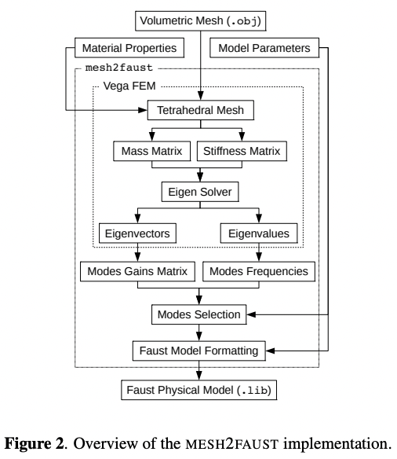

# mesh2audio

Generate axisymmetric 3D models, or import existing 3D models, and transform them into real-time playable physical audio models!

Supports fast DSP generation of physical audio models that sound decently realistic, as well as blazing fast 2D axisymmetric model generation, at the expense of some fidelity.

The generated audio model can be played in real-time by "striking" (clicking) on mesh vertices in the 3D mesh viewer.

This is the final project for Karl Hiner and Ben Wilfong for CSE-6730 Modeling & Simulation, Spring 2023.

Project video: https://youtu.be/RwxgOHVBDvc

Example audio output is in the [sound_samples](sound_samples/) directory.

Based on [mesh2faust](https://hal.science/hal-03162901/document).

Custom 2D axisymmetric FEM model designed and implemented by [Ben Wilfong](https://github.com/wilfonba).
(Ben implemented everything under the `fem` directory.)

## Build app

### Install dependencies

#### Mac

```shell
$ brew install glew llvm eigen
```

#### Linux

(Only tested on Ubuntu.)

```shell
$ sudo apt install llvm libeigen3-dev
$ export PATH="$PATH:$(llvm-config-15 --bindir)"
$ sudo apt-get install libc++-dev libc++abi-dev
```

Install GTK (for native file dialogs):

```shell
$ sudo apt-get install build-essential libgtk-3-dev
```

Install OpenGL (via glut) and glew:

```shell
$ sudo apt-get install libglu1-mesa-dev freeglut3-dev mesa-common-dev
$ sudo apt-get install libglew-dev
```

### Clone, clean and build app

```shell
$ git clone --recurse-submodules git@github.com:GATech-CSE-6730-Spring-2023-Project/mesh2audio.git
$ cd mesh2audio/app
```

- **Clean:**
  - Clean up everything: `./script/Clean`
  - Clean debug build only: `./script/Clean -d [--debug]`
  - Clean release build only: `./script/Clean -r [--release]`
- **Build:**
  - Debug build (default): `./script/Build`
  - Release build: `./script/Build -r [--release]`

Debug build is generated in the `./build` directory relative to project (repo) root.
Release build is generated in `./build-release`.

To run the freshly built application:

```sh
# The pplication assumes it's being run from the build directory when locating its resource files.
$ cd build # or build-release
$ ./mesh2audio
```

## `mesh2faust` architecture



## Why?

Convert 3D meshes to a physical audio model with real-time excitable vertices - what's not to love?

3D meshes are everywhere.
We use them for visual rendering, but they can also be interpretted as physically plausible models for converting impulse forces into realistic audio responses (esp. when paired with material properties).
For example, striking a bell.

An implementation already exists (mesh2faust).
So what's missing?

- Very slow to compile.
  - "To give you an idea, analyzing a mesh with ~3E4 faces will probably take about 15 minutes on a regular laptop"
    - https://ccrma.stanford.edu/~rmichon/faustTutorials/#converting-a-mesh-to-a-faust-physical-model
  - todo measure perf on my machine as a baseline (KH)
- No visual interface at all.
  - Can't control mesh in real-time.
    (It relies on the user exporting a mesh from something like OpenScad->MeshLab, in a compatible format.)
- Limited configuration
  - E.g. constants representing material properties are baked in.
    Changing constants requires a full recompilation.
- Implementation relies on compiling to Faust, which introduces a dependency and likely a significant part of the compile times.
- Aspects of implementation obscured by 3rd party libraries (Vega FEM)
  - Also uses MKL, which is closed source

## Use cases

- Convert mesh + material props to real-time playable digital audio instrument
- Add audio to 3D animations
- Subcomponent for more complex downstream models like a physically-plausible video2audio?
  (Estimate time-varying meshes + materials from video. Estimate collisions between meshes. Convert vertices + materials + collisions to audio stream.)

## Proposal rough work plan

As you suggested, it probably makes sense to treat the FEM model as a library, and divide work between the library and the clientside stuff.

There's actaully a ton of work needed on the client side, so maybe that would be a clean way to divide work.

- Ben:
  - **Render an input volumetric mesh to mass/stiffness eigenvectors & eigenvalues.** (Everything in the "Vega FEM" box above.)
  - Given volumetric mesh (as an `.obj` file) & material properties (as `.mtl` file? GLTF? custom data structure?), produce:
    - Tetrahedral mesh -> (Mass/stiffness matrices) -> Eigen solver -> (Eigenvectors, Eigenvalues)
- Karl:
  - **Generate FEM inputs (mesh, materials), and render the FEM outputs to a modal physical audio model.** (Everything outside of the "Vega FEM" box.)
  - UI/UX/audio/mesh generation & editing
  - Provide volumetric mesh & material properties to FEM.
  - Take eigenvectors and eigenvalues from "Vega FEM" output, translating them to modes gain/frequency matrices.
  - Implement physical audio model parameter editor
  - Given model parameters + mass/stiffness eigenvectors/eigenvalues:
    - Produce (Gain/frequency matrices) -> Modes selection -> Audio rendering
  - Continuously fill the audio buffer based on the current mesh modes.
    - Initially implement using `mesh2faust->faust`, JIT rendering Faust to LLVM for runtime audio graph updates.
    - Next, render Faust->Julia->LLVM, JIT-loading LLVM on changes.
    - Next, render mesh modes directly to Julia, without Faust inbetween.
      - Measure performance improvement from skipping Faust compilation.
        Goal is real-time editing.

What if the interface for generating/manipulating meshes only handled one specific kind of operation - editing a 2D profile, and revolving it around an axis to create a 3D volumetric mesh.

The FEM and modal modeling would still all be more general, but I'm thinking of ways to focus/scope the UI editing part.
Could even just support parametrically generating bell meshes (mesh2faust references T. D. Rossing and R. Perrin, “Vibrations of Bells).

## Stack

- App: UI/UX/mesh/audio generation & editing
  - [ImGui](https://github.com/ocornut/imgui) + [SDL3](https://github.com/libsdl-org/SDL): Immediate-mode UI/UX, supporting many environments & backends.
  - [Faust](https://github.com/grame-cncm/faust): Render the mesh to an audio graph, with real-time interactive vertex excitation.
  - [miniaudio](https://github.com/mackron/miniaudio): Continuously render the modal physical model of the input 3D volumetric mesh to audio.
  - [tetgen](https://github.com/libigl/tetgen): Convert triangular 3D meshes into tetrahedral meshes.
  - [CDT](https://github.com/artem-ogre/CDT): Constrained Delaunay Triangulation, the default 2D polygon triangulation method
  - [earcut](https://github.com/mapbox/earcut.hpp): Simpler 2D polygon triangulation, provided as an option.
  - [glm](https://github.com/g-truc/glm): Frontend maths.
  - [nativefiledialog-extended](https://github.com/btzy/nativefiledialog-extended): Native file dialogs.
  - [nanosvg](https://github.com/memononen/nanosvg): Read path vertices from SVG files.
  - [ImPlot](https://github.com/epezent/implot): Plotting
  - [ImGuizmo](https://github.com/CedricGuillemet/ImGuizmo): Mesh transform and camera rotation gizmos.
  - [ImSpinner](https://github.com/dalerank/imspinner): Wicked cool loading spinners for ImGui.
- FEM:
  - 2D FEM: Custom Fortran implementation by [Ben Wilfong](https://github.com/wilfonba)
  - 3D FEM: [VegaFEM](https://github.com/grame-cncm/faust/tree/master-dev/tools/physicalModeling/mesh2faust/vega)
